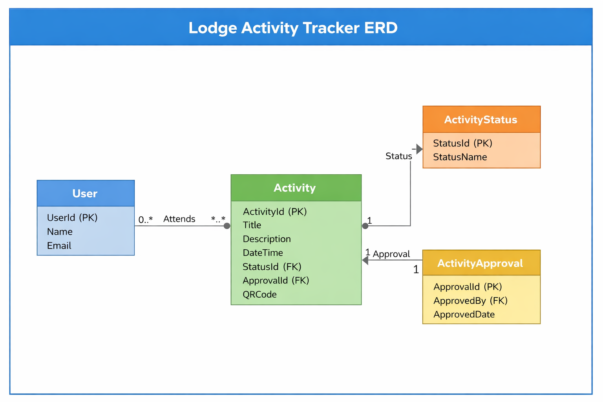

# Lodge Activity Tracker - Architecture

## 1. Overview
The application follows a **Layered MVC Architecture**:

- **Models**: Represent database entities (Activity, AdminDashboardViewModel, ErrorViewModel)
- **ViewModels**: For passing data to views (AdminDashboardViewModel)
- **Views**: Razor pages for UI (Admin, Account, Activities, Home, Shared)
- **Controllers**: Handle user requests and business logic (AdminController, AccountController, ActivitiesController, HomeController)
- **Data Layer**: ApplicationDbContext for database access, Migrations for schema evolution
- **Helpers**: QRCodeHelper for QR code generation
- **Seeders**: AdminSeeder for seeding default admin

## 2. Component Diagram
.png)

**Components:**
1. **Controllers**
   - Handle HTTP requests and return Views or JSON
2. **Models**
   - Represent database entities
3. **ViewModels**
   - Combine multiple models for view rendering
4. **Data Layer**
   - ApplicationDbContext
   - Migrations
5. **Helpers**
   - QRCodeHelper for generating QR codes
6. **Seeders**
   - AdminSeeder for default admin

## 3. Flow
1. User sends HTTP request → Controller.
2. Controller interacts with **DbContext** → retrieves data from SQL Server.
3. Controller passes data to **ViewModel**.
4. **View** renders UI.
5. Optional: Helper classes used (e.g., QRCode generation).

## 4. ERD Diagram
For a clear understanding of the data model, refer to the ERD diagram below:

**Entities:**
- **User**: IdentityUser (from ASP.NET Identity)
- **Activity**
  - Id
  - Title
  - Description
  - DateTime
  - StatusId (FK → ActivityStatus)
  - ApprovalId (FK → ActivityApproval)
  - QRCode
- **ActivityStatus**
  - Id
  - Name (Pending, Approved, Rejected)
- **ActivityApproval**
  - Id
  - ApprovedBy (FK → Admin)
  - ApprovedDate

**Relationships:**
- ActivityStatus ↔ Activity (1:N)
- ActivityApproval ↔ Activity (1:1)
- User ↔ Activity (Many-to-Many for attendance)
